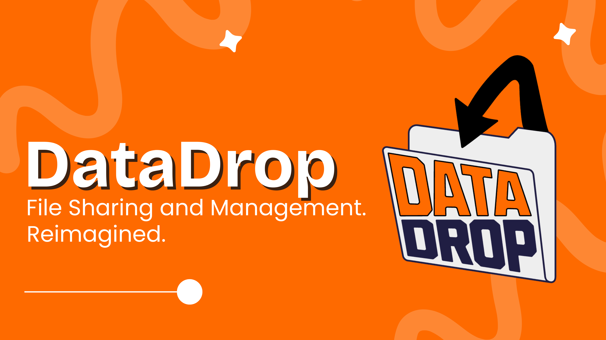
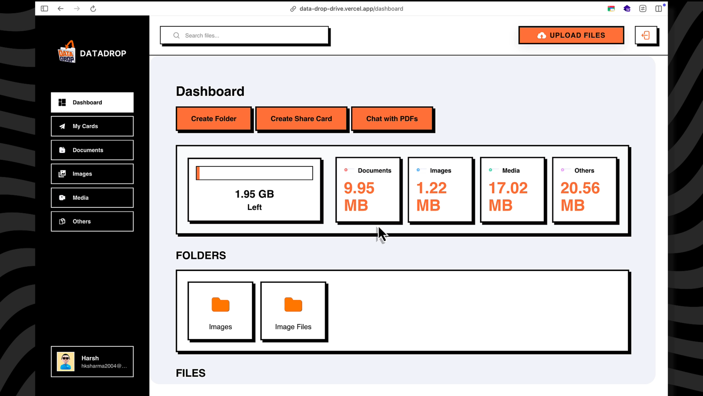
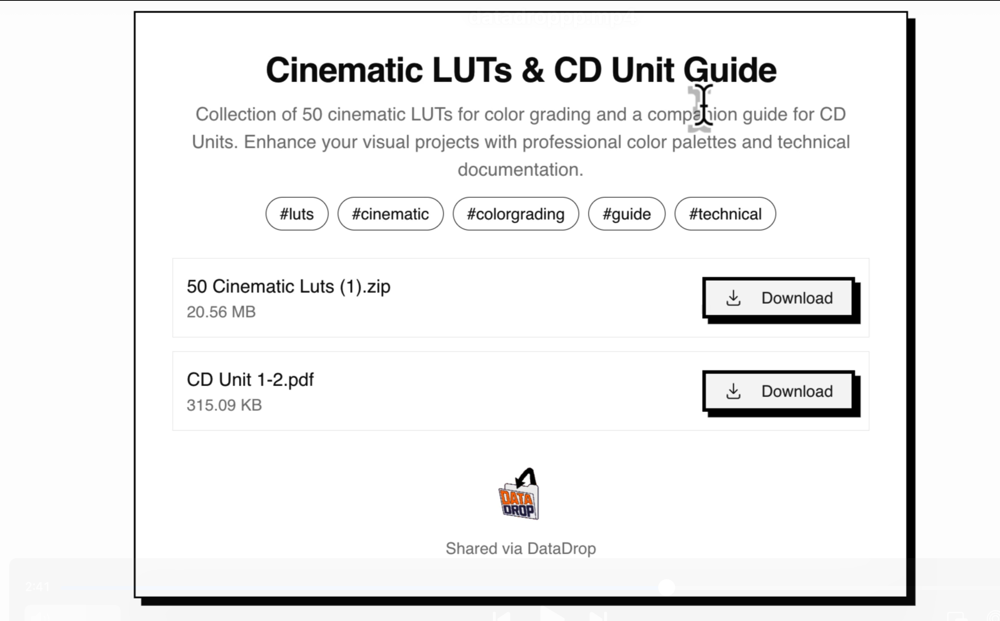
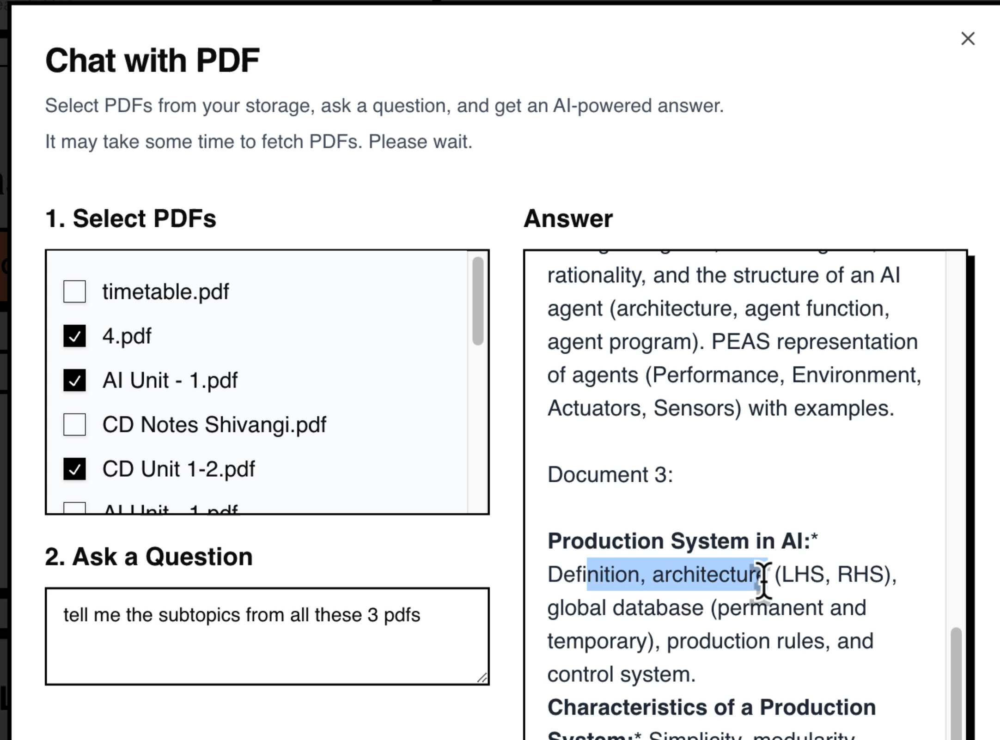
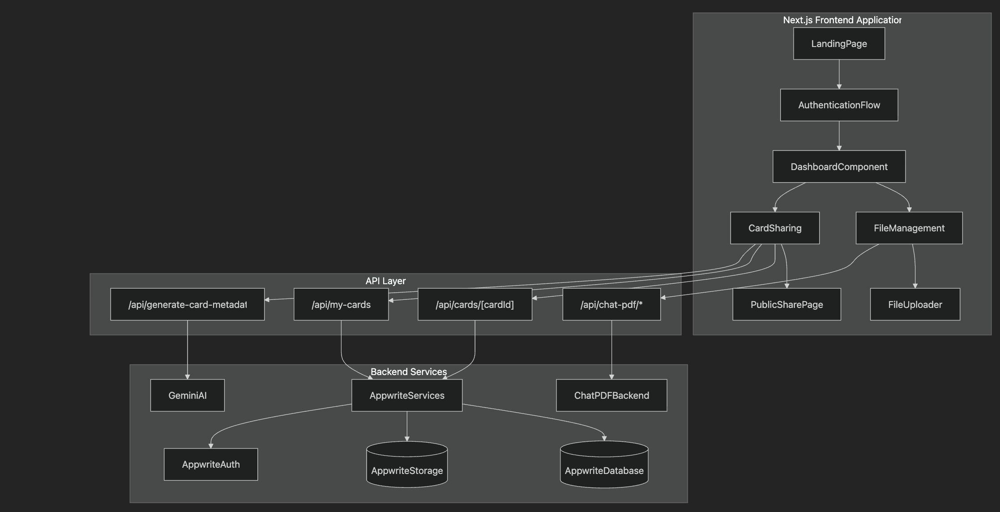
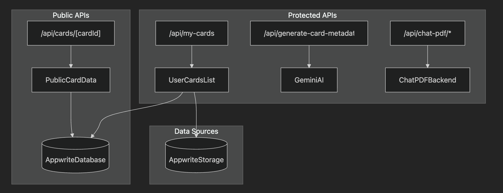

# 📁 DataDrop - Smart File Management Reimagined




<div align="center">
  
  
  
  
  
</div>

<br />

<div align="center">
  <h3>🚀 A modern, AI-powered file sharing platform built with Next.js that revolutionizes how you upload, organize, and share files.</h3>
  
  <p>DataDrop combines blazing-fast performance with intelligent features like QR code sharing, AI-powered organization, and PDF conversations.</p>
</div>


## 📸 Screenshots


*Main Dashboard with File Management Interface*


*QR Code Generation and File Sharing*


*PDF Conversation with AI Assistant*

---

## ✨ Features

### 🚀 Smart Storage & Upload
- **2GB** of secure cloud storage with intelligent file organization
- Drag-and-drop interface with real-time upload progress tracking
- **50MB** maximum file size per upload with **100MB** total limit for share cards
- Production-grade security with Appwrite backend integration

### 📱 QR Code Sharing
- Instant QR code generation for seamless file sharing
- One-scan access to shared file collections
- Public shareable links with customizable permissions

### 🤖 AI-Powered Intelligence
- Smart folder organization with AI-suggested structures
- Automatic tagging with relevant keywords for quick discovery
- **PDF conversations** - Ask questions and get answers from your documents
- Intelligent file analysis for better content organization

### 📊 Advanced File Management
- Organized dashboard with dedicated sections for Documents, Images, Media, and Others
- File cards system for grouping related files together
- Advanced search and filtering capabilities
- Collaborative sharing with team members

---

## 🏗️ Core Features and Systems

### System Architecture



*DataDrop System Architecture and Component Flow*

### Core API Endpoints

#### Public APIs
- **`/api/cards/[cardId]`** - Retrieve public card data and files
  - Returns: Public card information and downloadable files
  - Access: Public (no authentication required)

#### Protected APIs
- **`/api/my-cards`** - Manage user's file cards
  - Returns: User's created cards with metadata
  - Access: Authenticated users only

- **`/api/generate-card-metadata`** - AI-powered card generation
  - Service: Gemini AI integration
  - Returns: Smart metadata and organization suggestions
  - Access: Authenticated users only

- **`/api/chat-pdf/*`** - PDF conversation endpoints
  - Service: ChatPDF Backend integration
  - Returns: AI responses to PDF-based queries
  - Access: Authenticated users only

### Data Flow Architecture



*DataDrop API Endpoints and Data Flow Structure*

---

## 🛠️ Tech Stack

| Category | Technology |
|----------|------------|
| **Frontend** | Next.js 15 with React 19 (RC) |
| **Styling** | Tailwind CSS with custom Neobrutalism theme |
| **UI Components** | Radix UI + Custom components |
| **Backend** | Appwrite for storage and database |
| **AI Integration** | Gemini AI for intelligent features |
| **File Handling** | React Dropzone with custom upload system |
| **QR Codes** | QRCode.react for sharing functionality |
| **Language** | TypeScript |

---

## 🚀 Getting Started

### Prerequisites

- Node.js 18+ and npm/yarn
- An Appwrite account and project setup
- Environment variables configured

### Installation

1. **Clone the repository**
   ```bash
   git clone https://github.com/hksharma2004/data-drop-frontend.git
   cd data-drop-frontend
   ```

2. **Install dependencies**
   ```bash
   npm install
   ```

3. **Environment Setup**
   
   Create a `.env.local` file with the following variables:
   ```env
   # Appwrite Configuration
   NEXT_PUBLIC_APPWRITE_ENDPOINT=your_appwrite_endpoint
   NEXT_PUBLIC_APPWRITE_PROJECT=your_project_id
   NEXT_PUBLIC_APPWRITE_DATABASE=your_database_id
   NEXT_PUBLIC_APPWRITE_USERS_COLLECTION=your_users_collection_id
   NEXT_PUBLIC_APPWRITE_FILES_COLLECTION=your_files_collection_id
   NEXT_PUBLIC_APPWRITE_SHARED_CARDS_COLLECTION=your_shared_cards_collection_id
   NEXT_PUBLIC_APPWRITE_FOLDERS_COLLECTION=your_folders_collection_id
   NEXT_PUBLIC_APPWRITE_BUCKET=your_storage_bucket_id
   NEXT_APPWRITE_KEY=your_appwrite_api_key
   
   # AI Integration 
   GEMINI_API_KEY_METADATA=your_gemini_api_key
   CHATPDF_API_KEY=your_chatpdf_api_key
   ```

4. **Setup Appwrite Database**
   ```bash
   npm run db:setup
   ```

5. **Start the development server**
   ```bash
   npm run dev
   ```

6. **Visit your application**
   
   Open [http://localhost:3000](http://localhost:3000) to see your application running!

---

## 📱 Usage

### File Upload


1. Navigate to the dashboard and drag files into the upload area
2. Monitor real-time progress with visual indicators
3. Organize files into custom folders and collections

### Creating Share Cards

1. Select multiple files from your library
2. Create a shareable card with custom metadata
3. Generate QR codes for instant mobile sharing

### AI Features

1. Use AI suggestions for optimal folder organization
2. Chat with PDF documents to extract information
3. Leverage automatic tagging for better file discovery

---

## ⚙️ Configuration

### File Size Limits
- **Maximum individual file size**: 50MB (recommended for optimal performance)
- **Total share card limit**: 100MB
- **Body size limit**: 100MB with optimized image handling

### Supported Features
- Large file uploads with progress tracking
- Multiple CDN source optimization
- Real-time upload status updates

---

## 🤝 Contributing

We welcome contributions! Here's how you can help:

1. **Fork the repository**
2. **Create your feature branch**
   ```bash
   git checkout -b feature/AmazingFeature
   ```
3. **Commit your changes**
   ```bash
   git commit -m 'Add some AmazingFeature'
   ```
4. **Push to the branch**
   ```bash
   git push origin feature/AmazingFeature
   ```
5. **Open a Pull Request**

---

## 📄 License

This project is **private**. All rights reserved.

---
